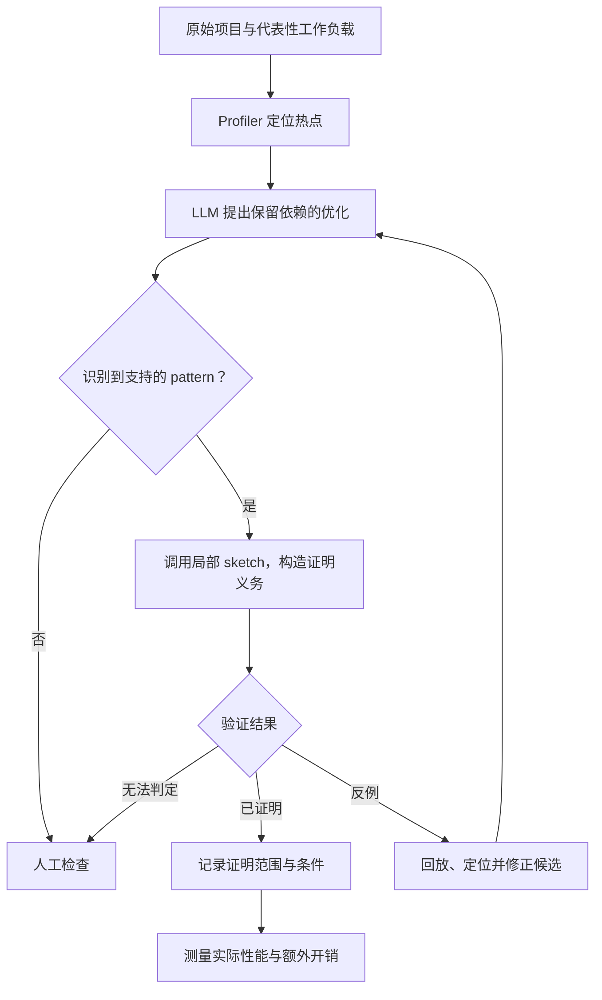

# 面向大型项目性能优化的局部条件等价验证

> 研究方案与原型阶段 · 更新于 2026-09-15
>
> 本文说明当前研究目标、方法设想与验证计划，供导师、研究成员和开发 agent 阅读。实现细节见交接文档及仓库代码；本文不代表完整系统已经实现。

接续开发请先读[当前状态与交接](docs/PROJECT_STATUS.md)、[开发记录](CHANGELOG.md)及[C 工具开发计划（提议）](docs/DEVELOPMENT_PLAN.md)。近期优先完成可复现、可接入新案例的 C 条件等价工具，再评估局限与其他语言复用；下文保留长期研究背景。

已开始实现 [agent 辅助条件等价工作流](docs/AGENT_WORKFLOW.md)：外部 agent 通过 JSON 提议条件和输入，工具提供原生执行筛查、后端认证与跨轮反馈。现已增加[通用 C 标量接入](docs/C_SCALAR_TOOL.md)：两份受支持的 C 源码加契约配置即可生成 harness，并复用查区域和 agent 会话；本地测试通过，用户已反馈 Codespace 的新增验收 **8/8 通过**（[结果与证据路径](docs/validation/c-scalar/user-reported-results.md)，原始归档尚未独立审阅）。尚未支持任意 C 程序或自动模型 API。

新增[冻结引擎后的多输入接入实验](cases/c_scalar_transfer/README.md)：用交换区间边界检查的例子，对照默认词汇与通用排序词汇，记录条件、查询数和失败；核心引擎不改，本地 9 项检查通过；用户已报告 **8/8 必需运行通过、8/12 得到 EXACT**（[结果与解释](docs/validation/c-transfer/user-reported-results.md)）。默认词汇的 4 次探索运行未得到 EXACT，具体状态和原因待查看完整指标。

已实现 [M2 统一结果与诊断报告](docs/RESULT_FORMAT.md)：保留旧 JSON，新增版本化结果和可读报告，区分精确区域、充分区域、未知与空输入域。本地 120 项回归通过，用户已报告 Codespace **M2 验收 10/10 通过**（[结果与证据路径](docs/validation/m2-results/user-reported-results.md)，原始归档尚未独立审阅）。旧冻结引擎实验需在原提交的独立 checkout 重跑。

新增[可演示的 C 端到端流程](cases/c_scalar_demo/README.md)：一条命令生成四种结果的总览、已实际重放的反例和独立归档；也提供复制两个 C 文件与 JSON 约定后直接接入的步骤。证明引擎不变，用户已报告 **READY，5/5 检查通过**（[结果与证据路径](docs/validation/c-demo/user-reported-results.md)，原始归档尚未独立审阅）。

新增 [M3 第一步：通用 C 只读表](cases/c_readonly_tables/README.md)。函数内部固定长度、完整初始化的 const 数组已接入通用接口，可直接比较质数计算与查表，不需专用 Python adapter。本地 136 项回归通过；新增 9 项正式验收待 Codespace 运行。数组参数、输出数组与可变状态仍待后续开发。

## 1. 研究目标

本项目研究如何在已有大型软件项目或重要程序案例中，让 LLM 辅助进行性能优化，并为优化后的程序提供明确范围内的语义保持保证。

核心思路是：**识别重复出现的优化 pattern，调用相应的局部证明方法，验证具体修改及其成立条件，并复用这些证明结构。**

研究目标是**支持多种语言中的同语言修改**，例如 C→C、C++→C++、Python→Python；不要求跨语言验证。C 是当前第一个实现后端，不是研究范围的限制；目前尚未实现任意语言支持。优化时原则上保留相同依赖库。FaaS/serverless 和跨语言转译属于旧阶段背景，不再作为当前主线；已有验证基础设施继续复用。

目标应用包括服务器、存储系统、浏览器组件和模型推理框架中的性能相关模块。具体项目与 benchmark 尚待确定，这些是候选场景，不是已经支持的项目列表。

## 2. 动机与研究假设

LLM 可以提出性能改写，但性能提升和语义保持是两个不同的问题。候选修改即使通过现有测试，也可能在未覆盖的输入、状态或调用序列上改变行为。大型项目通常包含复杂依赖，对整个项目重新建模和证明的成本又很高。

我们的初步观察是，许多优化具有相似的出发点，例如复用计算结果、消除重复工作、移动循环不变计算、调整数据访问方式。不同代码中的优化可能共享部分正确性论证。

因此，我们提出以下待验证假设：

| 假设 | 需要取得的证据 |
|---|---|
| 有实际价值的优化中存在可重复识别的 pattern | 对真实性能 patch 分类，分析模式覆盖率及收益 |
| 部分 pattern 共享可复用的局部证明结构 | 在未参与模板构建的实例上复用，并测量新增证明义务 |
| 检查实例条件比从头验证修改更经济 | 在相同验证范围与资源预算下比较时间、成功率和人工工作量 |
| 局部方法能在大型项目中形成有用的验证覆盖 | 检查上下文提取成本、库处理成本及无法处理的比例 |

“性能思路相似”不自动意味着“证明相同”。例如，请求内的计算复用与跨请求的有状态缓存可能需要不同的不变量和失效条件。我们不会预先假定少量模式可以证明大部分优化。

## 3. 拟议方法

系统包含性能优化与正确性验证两个相互衔接的环节：profiler 提供热点证据，LLM 提出候选修改，验证器负责检查具体语义性质。



匹配 pattern 是选择验证方法的步骤，不是等价性结论。即使通用规则已经证明，仍需要检查当前实例满足其适用条件。人工审核结果与工具证明结果分别记录。

### Pattern 与 sketch

- **Pattern**：优化的结构或语义类别，用于识别候选修改适合采用哪种方法。
- **Sketch**：与某类 pattern 对应、可在局部调用的证明辅助内容或方法。

Sketch 的具体形式尚未确定。它可能包含验证 harness、不变量、前置条件、库摘要、证明步骤或已证明的参数化规则。当前先验证后端能力，再根据真实案例决定需要何种表示与复用粒度。

如果复用的是完整定理，需要检查实例条件；如果复用的是未完成的证明草图，需要补全并验证。自然语言解释或代码结构相似性本身不构成证明。

## 4. 什么叫局部条件等价

设优化前后程序分别为 $P_o$、$P_n$，共享逻辑输入为 $x$，初始状态为 $s_o$、$s_n$。用 $\rho(s_o,s_n)$ 表示两侧状态的对应关系，$D$ 表示合法域和建模前提，$\phi$ 表示候选等价条件。目标形式为：

$$
\forall x,s_o,s_n,\quad
D(x,s_o,s_n) \land \rho(s_o,s_n) \land \phi(x,s_o,s_n)
\Rightarrow
\operatorname{Obs}(P_o,x,s_o)=\operatorname{Obs}(P_n,x,s_n).
$$

`Obs` 必须按案例明确：可能包括返回值、后续代码可见的内存、文件输出、外部效果、异常及终止行为。性能与内部缓存布局通常不要求相同，但不能无说明地忽略相关行为。

“条件”不限于数值区间，也可能是缓存有效、依赖未变化、数组不别名或计算不溢出等谓词。寻找条件与验证给定条件是两个不同任务；验证成功也不意味着已经找到最大的等价域。

### 局部证明的边界

局部验证区域不必等于 Git diff 的修改行。它可能需要包含初始化、状态更新、调用协议，以及其他影响该修改的代码。

将局部结论用于整个项目，需要检查真实上下文满足前提，并保证该区域对外可见的行为保持一致。对于可反复调用的有状态组件，还要验证执行后继续保持必要的状态关系或不变量。

若只能证明条件 $\phi$ 内等价，应明确报告它。未来可以研究在可安全检查的条件下使用 guard 和原始路径 fallback；这要求同时验证分支切换和状态维护，不是当前已经完成的部署机制。

### 结果语义

| 结果 | 含义 |
|---|---|
| `EQ` | 在声明的合法域、模型和完整性范围内，已证明目标观察行为一致 |
| 条件等价 | 在明确的 $\phi$ 下取得 EQ，并单独记录覆盖范围；不预设现有 CLI 已有独立状态码 |
| `NEQ` | 存在满足相关前提的行为差异；应提取、核实并尽可能回放反例 |
| `UNKNOWN` | 超时、不支持、建模失败或证明不完整，当前不能判定 |

对区域 D 的 NEQ 只表示其中存在反例，不表示整个区域都不等价。UNKNOWN 也不能被解释为程序错误或验证通过。

## 5. 依赖库如何处理

当前约束是优化前后保留相同依赖库，必要时固定版本与构建产物。这有助于共享库摘要、复用调用契约，并减少重复展开内部实现的成本。

但依赖身份相同不代表调用行为相同。优化可能减少调用次数、改变参数或顺序，或者延长返回结果的复用时间。此时仍需验证相关的确定性、副作用、状态依赖和结果映射条件。

拟按需要使用以下方法：

- 对能够对应的调用共享摘要或契约。
- 只提取与修改相关的实现和调用上下文。
- 根据静态事实或明确条件做调用点特化，并验证特化结果与原始实现一致。
- 对超出模型或证明能力的情况保留 UNKNOWN。

同语言设置减少了跨前端、类型表示及运行时对应的负担；缓存状态、指针别名、初始化、并发与库调用协议仍是需要处理的语义问题。

## 6. 当前最小案例：缓存优化

导师提出的近期任务是比较三个简单 C/C++ 程序版本：原始程序、正确缓存优化，以及 cache miss 返回错误值的缓存版本。缓存用于检验方法是否可行，不限定长期研究范围。

一个已运行的 C 参照案例使用单条目缓存：

| 版本 | 行为 |
|---|---|
| 原始版 | 返回 `uint32_t` 的 `x + 1`，按 C 无符号语义回绕 |
| 正确缓存版 | 命中时返回缓存；未命中时计算、保存并返回正确值 |
| 错误缓存版 | 命中正常；未命中时保存正确值，但返回 `0` |

空缓存下输入 `1`，原始版返回 `2`，错误版返回 `0`。连续输入 `7,7,8` 时，正确版返回 `8,8,9`，错误版返回 `0,8,0`。

关系 harness 让两个版本接收相同符号输入，并断言返回值一致。缓存需在调用间保持。正确版还可借助不变量：

```c
!cache.valid || cache.value == original(cache.key)
```

分别验证初始化与任意一步的输出等价、不变量保持，再通过归纳论证覆盖任意有限调用序列。只检查固定次数的调用，不能单独得到这一结论。

该例范围为顺序执行、私有缓存、无其他修改者，不包含真实库、动态分配或并发；简单计算只用于验证机制，不代表缓存带来了性能提升。

## 7. 已有基础与当前进展

### 仓库后续实现：同语言缓存与条件搜索

- 已接入 C→C 缓存验证。用户在 Codespace 的定制 ESBMC 8.4.0 上反馈：此前提交 `faf3ddc` 的 20 项测试、新缓存 6 项验证和旧 Python/C 6 项回归均通过。
- 新增借鉴 Agentic Concolic Execution 的轨迹引导条件 finder：原生执行提供搜索线索，ESBMC 独立证明候选区域及最终条件。当前是无需 LLM API 的缓存族基线，支持可选 agent 假设文件；不表示完整多 agent 系统已实现。
- [方法、证明边界与 Codespace 测试命令](docs/TRACE_GUIDED_FINDER.md)。新 finder 的正式 ESBMC 验收结果以实际运行日志为准。
- 用户已反馈提交 `94188b7` 的 `FINDER ACCEPTANCE: 5/5 passed`；完整 Codespace 日志仍由用户保存。
- [配置变化缓存实验与独立归档命令](cases/config_cache/README.md)：复用搜索/证明引擎，新增当前配置与历史缓存配置的手工模型；该阶段本地 48 项测试通过。
- 用户已反馈配置缓存阶段 `CONFIG CACHE ACCEPTANCE: 3/3 passed`。随后新增[共享 cache proof sketch](docs/CACHE_SKETCH_REUSE.md)：两个实例使用同一证明模板，保存模板与绑定哈希，并增加正反例控制。本地共 53 项测试通过；这次模板重构的 ESBMC 回归待 Codespace 运行。
- 用户随后确认共享 sketch 正式回归为 5/5、3/3、8/8，证据保存在其 Codespace。
- 下一阶段已加入[质数计算与查表](cases/prime_lookup/README.md)：无可变状态、包含循环与只读表，在明确的有限输入域内自动搜索条件。本地共 61 项测试通过，新案例 ESBMC 验收待运行。
- 用户已反馈 prime 第一阶段 5/5 通过，截断版 0..63 用了 86 次 finder 查询。现增加已证明条件的有限域紧凑表示和 0..127 扩域对照，记录查询数与耗时；本地共 63 项测试通过，扩域正式验证待运行。
- 用户已确认扩域 8/8 通过；截断版 0..63 为 86 次查询、17.742 秒，0..127 为 204 次、43.174 秒。下一轮[取模词汇对照](cases/prime_lookup/VOCABULARY_COMPARISON.md)保持初始输入和预算一致、交换运行顺序，共 24 次运行。本地 69 项测试通过，正式对照结果待运行。
- 后续用户反馈取模对照 **24/24 certified，paired inputs match=True**：truncated 0..127 查询从 204 降至 35，但 mutant 从 10 增至 30。详见[用户结果记录及证据位置](docs/validation/vocabulary-comparison/user-reported-results.md)。这是对上一项待运行状态的更新；本地没有重新运行正式证明。

### 交接材料中的历史基础

以下状态只覆盖现有交接材料及 2026-09-10 的独立实验。用户已在 Codex 中继续开发，后续代码进展应以实际仓库核实并更新，不能由本文推定。

| 资产或实验 | 已知进展 | 证据边界 |
|---|---|---|
| 定制 ESBMC 与关系验证 oracle | 旧交接记录了目标选择、共享符号输入、GOTO 合并、反例解析与 EQ/NEQ/UNKNOWN 分类 | 主要由旧 Python/C 流程发展而来；当前同语言集成状态待代码核实 |
| 条件域搜索 | 旧交接记录了域约束和递归划分；Fibonacci 小域中自动找出等价区域 | 不是通用大域、多维谓词发现器 |
| 结构状态谓词原型 | 有限抽象状态的错误集合可概括为可读条件 | 不代表任意输入对象已自动建模 |
| zlib Adler32 特化验证 | 旧交接记录了纯 C 原始实现与特化切片在四字节调用契约下验证成功 | 为已有同语言先例；不是整个库的普遍等价结论 |
| 缓存参照实验 | 独立原版 ESBMC 8.5.0/Z3 验证正确版、发现错误版，并经 GCC 回放；初始化及不变量保持也通过 | 不变量人工提供；当时未接入用户定制工具，未自动发现缓存等价条件 |
| 完整 profiler→LLM→pattern→局部证明流程 | 当前研究目标 | 尚无材料证明整条流程已经完成 |

已有实现细节见 `CODEX_HANDOFF_SAME_LANGUAGE_EQUIVALENCE.md`；旧阶段历史见 `PROJECT_HANDOFF.md`。这些文件若随仓库提供，应与代码共同核对。本文不规定尚未确认的安装命令、目录结构或 CLI。

## 8. 研究问题与实验设计

### 研究问题

1. **覆盖性：**真实高价值优化中，有多少能识别 pattern 并完成局部验证？
2. **复用性：**同一 sketch 在新实例、新项目上能复用多少内容，需要补充哪些条件？
3. **验证价值：**能否发现已有测试或审查未覆盖的语义回归，并提供真实反例？
4. **验证成本：**相对于逐例从头证明，是否降低求解时间、人工建模和失败比例？
5. **优化收益：**通过验证的候选，在代表性工作负载上是否仍有实际收益？

### 两条互补的实验路线

**历史 patch 验证。** 按预先确定的标准收集性能修改，用一部分构建 sketch，在独立实例上评估，随后检查跨项目迁移。保留无法支持和无法证明的案例。对于发现的差异，确认合法输入、可达状态、预期语义保持目标及真实执行结果，排除有意行为变更和抽象伪反例。

**在线优化验证。** 使用 profiler 与 LLM 产生新候选，接入相同验证后端，测量通过率、实际性能及缓存维护或 guard 的额外开销。性能评估采用未被反复调优污染的工作负载，区分局部加速与项目整体收益。

拟比较测试检查、逐例局部验证和 sketch 复用等设置；控制代码抽取范围与验证预算，避免把切片改进误算成证明复用收益。指标包括 EQ/NEQ/UNKNOWN 分布、反例真实性、人工投入、验证时间和实际加速。

发现历史 bug 能说明检测价值，但不能单独证明复用性、覆盖性或整个系统的正确性。形式化保证来自明确的模型、证明义务与验证结果，实验用于评估能力和成本。

### 与已有研究的关系

参数化优化规则验证、从证明中泛化规则、优化前置条件推断已有研究基础。项目的新颖性不能仅依赖“优化有 pattern”或“局部证明可以复用”，需要通过与相关方法的比较进一步确定。

前期讨论涉及的直接参考包括：

- [PEC：Proving Optimizations Correct using Parameterized Program Equivalence（PLDI 2009）](https://www.cs.cornell.edu/~lerner/papers/pldi09-pec.html)
- [Generating Compiler Optimizations from Proofs（POPL 2010）](https://www.cs.cornell.edu/~lerner/papers/popl10.html)
- [Alive-Infer：Precondition Inference for Peephole Optimizations in LLVM](https://arxiv.org/abs/1611.05980)

拟探索的贡献是：将这些思想用于真实大型项目中的高层性能修改，结合实例条件、依赖契约和局部状态关系，实现有实际覆盖率的证明复用。具体贡献仍需原型和实验支撑。

## 9. 近期工作与 agent 阅读约定

### 近期顺序

以下为早期步骤，前三项已有后续实现。当前接续顺序和发布验收目标以[开发计划](docs/DEVELOPMENT_PLAN.md)为准。

1. 核对并恢复现有定制 ESBMC、关系 oracle 和已成功案例。
2. 在现有流程中接入同语言的原始/正确缓存/错误缓存三版本验证。
3. 明确缓存状态建模、证明范围和反例回放，再连接已有条件域机制。
4. 收集少量真实性能 patch，确定值得支持的 pattern 及最小 sketch 形式。
5. 在独立实例上检验证明复用，随后连接完整热点定位与 LLM 优化流程。

### 给后续 agent

- 以用户最新指令和仓库适用说明为准；不要自动恢复旧 FaaS 或跨语言路线。
- 优先复用已有实现。实现状态、命令和实验结果必须由代码或日志确认，不能把方案写成成果。
- 不把独立原版 ESBMC 的结果归到用户定制工具名下。
- 保留 UNKNOWN，明确输入域、状态前提、观察项和完整性范围。
- 识别 pattern 后仍需验证；LLM 的解释、相似代码和测试通过都不能替代证明。
- Sketch 尚未定型，不因本文举例就锁定某种表示、特定缓存机制或唯一目标项目。
- 更新结果时记录 commit、验证器版本、实际命令、结果和限制，使导师与后续 agent 可以复核。
