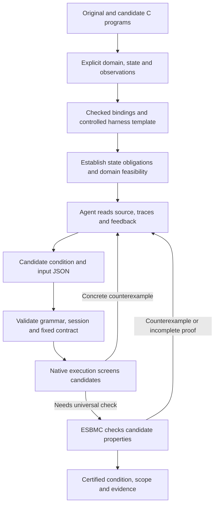

# Agent-assisted conditional equivalence workflow

Updated 2026-09-16. The user approved beginning this direction. The current
implementation is a file-mediated candidate feedback loop over three reviewed
C adapters, not an arbitrary-program frontend or an autonomous model API client.

## Intended workflow and trust boundaries



Agent proposals are fallible. They may change exploration efficiency or which
conditions are found, but cannot directly supply a proof verdict, a native
output label, executable code, a smaller domain or a new assumption.

The backend proves the supplied harness. It does not by itself prove that an
arbitrary agent-generated harness faithfully represents the user's programs.
Consequently, the first implementation retains reviewed C adapters, state
invariants and harness templates. General C binding/config generation, checked
program extraction and invariant proposals are later work.

The design borrows the concrete-execution/agent-feedback idea from
[Agentic Concolic Execution](https://srg.doc.ic.ac.uk/publications/26-concollmic-sp.html).
Its test-generation results do not establish our equivalence claims. Our claims
come from separately checked properties under the declared model.

## Implemented now

- `agent_workflow.py start` creates a fresh session with fixed configuration,
  domain, model, tool identities, state obligations and native boundary traces.
- `step` validates one external proposal, recompiles/replays entry inputs, checks
  its condition and emits feedback for the next round. The same session can be
  resumed by another chat using the same Codespace filesystem.
- Supported adapters: `prime`, `cache`, `config-cache`. The original automatic
  predicate finder and `--hypotheses` batch interface remain available.
- Conditions are a bounded JSON Boolean tree over the existing safe entry-state
  predicates. Prime additionally supports the already-implemented modulo atoms.
- Wrong native candidates and malformed proposals consume no solver queries.
  A native equal input outside a proved condition disproves exactness and avoids
  a redundant complement query. Native results never establish a universal claim.
- Query count, active processing time and round limits span the entire session;
  time waiting for an external agent/user is not charged. Per-query timeouts still
  apply. Identity checks and ordinary file I/O are not hard real-time bounded.
- Fixed source/template/contract and direct compiler/ESBMC binary hashes are
  checked before and after verification work. Drift blocks continuation; restart
  after a code/tool/contract change. This is not a complete system-header/container
  snapshot, a cryptographic proof certificate or an OS sandbox.
- Session state and evidence are runner-owned trusted files. Give an external
  agent the context and a separate proposal output location; the data interface
  does not grant authority to rewrite session files or sources. Hash checks do
  not defend against an actor that can rewrite both the state and its hashes.

## Results

`result.json` reports the retained certified result and the latest proposal
separately. `best_result` retains a previous EXACT result; otherwise it stores
the most recent nonempty certified sufficient condition. It is not a largest-
coverage ranking and does not merge conditions across rounds.

| Status/location | Meaning |
|---|---|
| Overall `EXACT` | Equality within the condition and inequality throughout its complement are both PROVED under the fixed nonempty domain |
| Overall `PARTIAL` | A nonempty candidate has a sufficiency proof; exactness has not been established |
| Overall `UNKNOWN` | No retained certified condition; native agreement alone is insufficient |
| Latest `REFUTED` | A concrete execution or the backend refuted this candidate's sufficiency; does not mean all inputs differ |
| Latest `REJECTED` | Invalid protocol/grammar/input proposal; no solver query issued |
| Latest `EMPTY_CANDIDATE` | Vacuous candidate without a useful nonempty sufficient region or exact all-unequal proof |
| Phase `READY` | Initialization/state obligations and domain feasibility established; this is not yet an equivalence conclusion |
| Phase `EMPTY_DOMAIN`, `UNKNOWN`, `BLOCKED` | No new proposals accepted; inspect initialization/drift feedback and start a fresh valid session |

For fixed domain D and observation equality E, the central obligations are:

```text
D && condition  => E
D && !condition => !E   (required for EXACT)
```

Cache initialization and invariant preservation are additionally checked at
session start; their results are reused only within the unchanged session.
These remain one-call conditions under an explicit invariant, not arbitrary
sequence claims. Safety and unwinding checks stay enabled in backend queries.

With `--goal sufficient`, the tool stops checking a candidate after establishing
nonemptiness and sufficiency; the result remains PARTIAL but `goal_reached=true`.
With `--goal exact`, a sufficient condition is feedback for further refinement.
A false condition may be EXACT if a nonempty domain is proved entirely unequal.

## Codespace protocol acceptance

The user has now reported **8/8 passed**. See the [transcript and archive
location](validation/agent-workflow/user-reported-results.md). The commands below
remain available for reproduction; a new full acceptance run is not required just
to start a proposal session on this unchanged implementation.

```bash
git pull --ff-only origin codex/same-language-cache
bash cases/agent_workflow/test_agent.sh /workspaces/esbmc-current/build/src/esbmc/esbmc
```

The script runs finder/native tests and eight scripted controls across all three
adapters, then archives an independent run under `$HOME/equiv-evidence`.
Expected summary: `AGENT WORKFLOW ACCEPTANCE: 8/8 passed`.
The missing-solver control must remain UNKNOWN. Six final EXACT results also
receive independent expected-condition checks; sufficient-only has no exactness
claim. The proposals are prewritten protocol controls, **not an agent-discovery
benchmark**. No performance improvement or LLM accuracy is measured here.

## Running a real agent-assisted session

Start a prime session using the existing modified ESBMC:

```bash
python3 tools/find-cond-equiv/agent_workflow.py start --case prime --variant truncated --domain 0:127 --goal exact --esbmc /workspaces/esbmc-current/build/src/esbmc/esbmc
```

Use the emitted `Session:` path in the next command. Read its `agent-context.json`
and give it to the agent with this instruction:

> Propose the next condition using only the fixed program, declared contract,
> observed inputs and feedback in this context. Write a separate proposal JSON
> matching proposal_schema and condition_grammar. Preserve session_id and the
> next round number. Do not read expected-answer/control scripts, modify scope
> or session files, or invent execution results. Your proposal will be checked.

Example syntax only (replace the session ID and round from the context):

```json
{
  "session_id": "COPY_FROM_CONTEXT",
  "round": 1,
  "condition": {"any": ["x <= 31", "x % 2 == 0"]},
  "seeds": [{"x": 35}]
}
```

This is a candidate, not a promised complete answer. Submit it using:

```bash
python3 tools/find-cond-equiv/agent_workflow.py step --session PATH_FROM_START --proposal proposal.json
```

Read the updated context, propose again, and repeat. There is no automatic LLM
API call or background polling in this first version. `start` exits 0 only when
READY. `step` exits 0 when the session goal has been reached (including a retained
earlier certificate), otherwise 2. Always inspect latest_feedback separately.

Grammar: JSON `true`/`false`, safe atom strings, or single-key `all`, `any`, `not`
objects. `all`/`any` use nonempty arrays. Limits are 128 tree nodes, depth 12,
256 seeds and 64 KiB per proposal. Duplicate JSON keys, non-finite numbers,
unknown fields, output labels, out-of-domain seeds and stale rounds are rejected.
Defaults: 8 rounds, 64 queries, 300 active seconds, 30 seconds per query.

Each round preserves proposal, source/harness snapshots, native traces/replays,
query commands/logs and result. `session.lock` prevents concurrent updates. A
crashed command may leave its lock: verify the old command has stopped before
removing the lock; do not blindly rerun a partially written round. Start a new
session if uncertain. Sessions do not automatically migrate their toolchain.

## Next implementation steps

1. Protocol acceptance is user-reported 8/8; preserve its evidence archive.
2. Try an actual Codex-authored proposal loop and record prompts, proposals,
   feedback, human interventions, total time and model usage when available.
   A trial on the familiar prime case checks integration only; prior knowledge
   of its answer rules it out as a held-out discovery/performance measurement.
3. Introduce the generic C scalar contract/binding layer with controlled harness
   generation; agent-assisted configuration should reduce adapter-writing work.
4. Add a provider transport for unattended rounds after the file protocol is
   validated. Compare it with the existing deterministic finder on held-out
   examples at matched total budgets, counting unsuccessful runs and agent cost.
